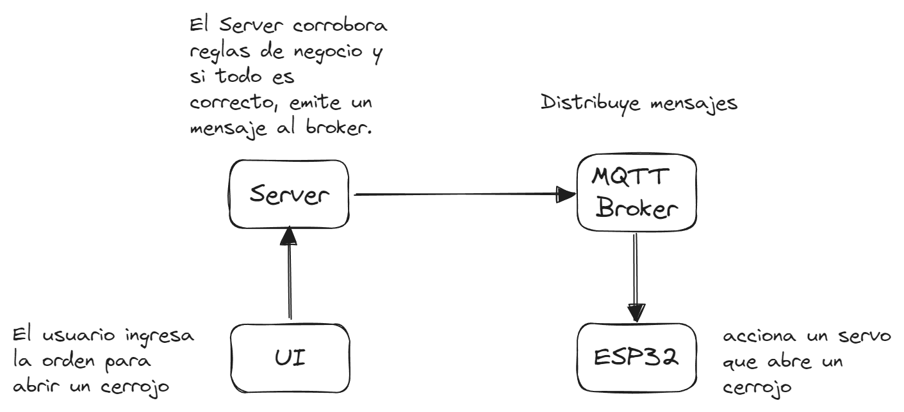

# Locker with NextJS and ESP32

Este template fue creado para aprender sobre tecnologías IoT combinando aplicaciones web desarrolladas con NextJS y placas ESP32.

## Entorno

Asegurarse de tener instalado GIT . Esto se puede revisar muy fácilmente a trevés del comando `git --version` . En caso de no estar instalado, se puede hacer a través de los siguientes paso

- En Linux, a través del comando `sudo apt install git`.
- En Windows, a través de la pagina oficial https://git-scm.com/

Procurar tener actualizado NodeJS a la versión `lts`. Si desea asegurarse, puede ejecutar el comando `npm doctor` que le indicara si cumple con los requisitos. Si el comando no se encuentra o indica estar desactualizado, puede instalar la versión `lts` mediante alguno de los siguientes pasos

- En Windows (con [scoop](https://scoop.sh/) ultra recomendado)
  - Abrir una terminal y ejecutar el comando `scoop install nvm`.

  - Inmediatamente después instalar NodeJS con el comando `nvm install lts`.

- En Linux, a través de [nvm](https://github.com/nvm-sh/nvm)

  - Abrir una terminal y ejecutar el comando que se encuentra en la sección [Install & update script](https://github.com/nvm-sh/nvm#install--update-script) del repositorio oficial de NVM.

  - Cerrar la terminal y abrir otra para ejecutar el siguiente comando `nvm install --lts`.

Es necesario contar con Aduino-CLI para ejecutar los correctamente diferentes scripts de este repo. Si ejecutando el comando `arduino-cli version` no se obtiene una respuesta satisfactoria, será necesaria la instalación de la aplicación.

- En Linux con el comando `sudo apt install arduino-cli`.
- En Windows con el comando `scoop install arduino-cli`

## Breve introducción



En este repo convergen dos aplicaciones, una aplicación que llamaremos “cliente” que esta comprendida a su vez por una interfaz web y un servidor. Por otro lado, tenemos una aplicado que se ejecuta en una placa ESP32 (o cualquiera de sus variantes) encargada de accionar un servo motor (o cualquier actuador que desee utilizar, esta parte queda por su cuenta).

Es necesario estar provisto por un broker `mqtt` ya sea tercerizado o auto administrado (recomendamos usar el popular broker `mqtt` conocido como [Mosquitto](https://mosquitto.org/download/) instalable en Windows con el comando `scoop install mosquitto`) y conocer los conceptos básicos que comprenden la comunicación mediante un broker `mqtt`.

En caso de utilizar Mosquitto como broker, puede encontrar en el archivo `./mqtt/mosquitto.conf` la configuración básica para dar de alta el servicio con el comando `mosquitto -c /path/to/mqtt/mosquitto.conf`.

## Configuración básica

En el archivo `./utils/config.mjs` pueden encontrar los principales parámetros de configuración para la correcta comunicación entre la aplicación cliente y la placa ESP32 a través de un broker `mqtt`.

- ⚙️`mqtt-host`: hosting del broker `mqtt` utilizado.
- ⚙️`mqtt-port`: puerto del broker `mqtt` utilizado.
- ⚙️`mqtt-topic`: topic al cual se suscriben y publican tanto la placa como la aplicación cliente.
- ⚙️`mqtt-msg-to-close`: palabra clave para ordenar a la placa el “cierre ” del cerrojo.
- ⚙️`mqtt-msg-to-open`: palabra clave para ordenar a la placa la “apertura” del cerrojo.

En el archivo `./esp32/wifi_config.h` se encuentran definidas las constantes que serán usadas por la placa ESP32 para conectarse a una red wi-fi.

## Instalación y ejecución

- 🛠Para instalar las dependencias ejecutar el siguiente comando `npm install`.
- ⚒Para construir todo el proyecto, ejecutar el siguiente comando `npm run build`.
- ⚒Para desplegar la configuración entre las distintas partes del proyecto, ejecutar el siguiente comando `npm run config` . Esta configuración es depositada en los archivos `./esp32/mqtt_config.h` y `./app/.env` para que cada de las partes puedan adoptarlas adecuadamente.
- ⚒Para desplegar aplicación cliente, ejecutar el siguiente comando `npm run deploy:app`.
- ⚒Para subir el código compilado a una placa ESP32, ejecutar el siguiente comando `npm run deploy:esp32`.
- 🧪Para ejecutar los test con Jest, usar el comando `npm run test`.

## Características

- [TypeScript](https://www.typescriptlang.org/)
- [NextJS](https://nextjs.org/)
- [Jest](https://jestjs.io/)
- [Testing Library](https://testing-library.com/)
- [Next-PWA](https://www.npmjs.com/package/next-pwa)
- [Arduino-CLI](https://arduino.github.io/arduino-cli/0.35/)

## Pasos para crear este template

Este proyecto esta listo para ser customizado, pero si te parece necesario, podes empezar todo desde cero. El primer comando a ejecutar es el que setea el proyecto desde cero.

```bash
npx create-next-app --example progressive-web-app my-pwa
```

Con esto, se creara una carpeta llamada “my-pwa”. Este nombre puede ser reemplazado en el mismo comando para ajustarlo a su proyecto.

Con el siguiente comando se puede incluir Jest como libreria para testing

```bash
npm install --save-dev jest jest-environment-jsdom @testing-library/react @testing-library/jest-dom
```

Como lo menciona la documentación oficial, es necesario crear el archivo `jest.config.js` con el siguiente contenido

```jsx
// jest.config.js
const nextJest = require('next/jest')

const createJestConfig = nextJest({
  // Provide the path to your Next.js app to load next.config.js and .env files in your test environment
  dir: './',
})

// Add any custom config to be passed to Jest
/** @type {import('jest').Config} */
const customJestConfig = {
  // Add more setup options before each test is run
  // setupFilesAfterEnv: ['<rootDir>/jest.setup.js'],
  // if using TypeScript with a baseUrl set to the root directory then you need the below for alias' to work
  moduleDirectories: ['node_modules', '<rootDir>/'],
  testEnvironment: 'jest-environment-jsdom',
}

// createJestConfig is exported this way to ensure that next/jest can load the Next.js config which is async
module.exports = createJestConfig(customJestConfig)
```

Por último, se incluye material UI como librería frontend

```bash
npm install @mui/material @emotion/react @emotion/styled 
```

```bash
npm install @mui/icons-material
```

## Pasos para customizar este template

### Favicon

Empieza eligiendo el icono o logotipo que representará a la pagina. Recomiendo https://favicon.io/ para este trabajo. Es rápido, sencillo, y nos provee de todo lo necesario para incluir el icono en la pagina. Cuando termine de crear la marca, descargue el comprimido y su contenido debe moverse a la carpeta `public` del proyecto. 

La propia pagina nos otorga los links que debemos pegar en el `Layout/components/Header` para que los iconos sean tomados en cuenta.

### Colores

Con la marca ya elegida, proceda a elegir los colores que serán parte del estilo de la pagina. En la carpeta `src/theme/Theme.tsx` se encuentra el componente a cargo de customizar la paleta de colores, además de otras características del estilo. Recomiendo leer los siguientes artículos para saber más.

- https://mui.com/material-ui/customization/theming/
- https://mui.com/material-ui/customization/color/

### Mobile

Para que la modalidad mobile sea una experiencia completa, se recomienda modificar los códigos de colores presentes en los archivos `manifest.json`, `site.webmanifest`, `src/layout/components/Header`.
